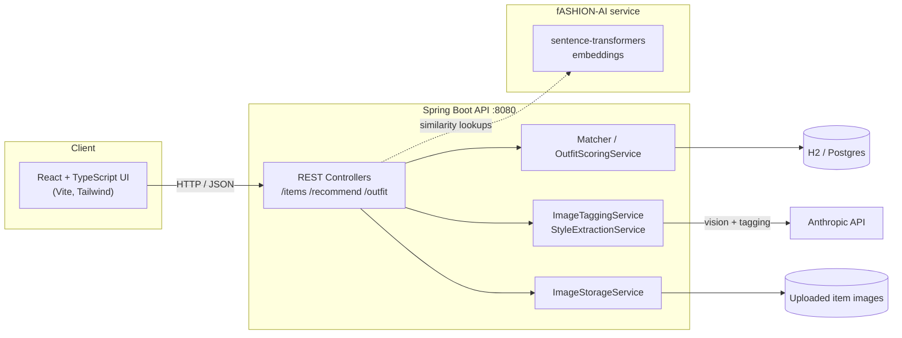

<div align="center">

# FIT // LAB

**A streetwear fit-builder app — build outfits, get AI-scored cohesion, and generate your best fit.**

[](https://github.com/mmarshall6402-oss/fitcheck/actions/workflows/deploy.yml)
[](https://github.com/mmarshall6402-oss/fitcheck/actions/workflows/deploy-frontend.yml)
[](https://github.com/mmarshall6402-oss/fitcheck/actions/workflows/build-artifacts.yml)
[](#)
[](#)

</div>

---

## What is this

FIT // LAB lets you browse a clothing catalog, drop items into a shirt / bottom / shoes
outfit builder, and get a live 0-100 **cohesion score** with rule-based reasons for *why*
an outfit works (or doesn't). Pin a piece as the anchor and hit **Generate best fit** to
have the backend brute-force the best-scoring combination from your catalog.

## Stack

<div align="center">

         

</div>

| Layer | Tech |
|---|---|
| **Backend** | Spring Boot 3 (Java 21), Spring Security + JWT, JPA/H2 (Postgres-ready) |
| **Frontend** | React 19, TypeScript, Vite, Tailwind CSS v4 |
| **AI / matching** | Anthropic (image tagging, style extraction), `sentence-transformers` embedding service (FastAPI) |
| **CI/CD** | GitHub Actions (backend deploy, frontend deploy, artifact builds) |

## Architecture



## Repo layout

```
fitcheck/
├── backend/       Spring Boot REST API — catalog, matching, outfit scoring
├── frontend/      React + TypeScript UI
└── fASHION-AI/    Python embedding / tagging service
```

- `backend/` — see [`backend/README.md`](backend/README.md) for config, endpoints, and architecture notes.
- `frontend/` — see [`frontend/README.md`](frontend/README.md) for the dev server and UI walkthrough.

## Quick start

```bash
# backend — serves on :8080
cd backend && mvn spring-boot:run

# frontend — serves on :5173, proxies API calls to :8080
cd frontend && npm install && npm run dev
```

Open `http://localhost:5173`. The catalog starts empty — add items via the UI or
`POST /items` / `POST /items/import`.

## How outfit scoring works

1. Add items to the catalog (name, category, color/vibe tags, optional photo).
2. Drop items into the **shirt / bottom / shoes** slots.
3. Once all three are filled, `GET /outfit/score` combines the three pairwise
   edges (shirt↔bottom, shirt↔shoes, bottom↔shoes) into one cohesion score.
4. Pin an anchor piece and hit **Generate best fit** — `GET /outfit/build`
   brute-forces the best-scoring combination around it.

---

<div align="center">

Built with Spring Boot, React, and a bit of Anthropic-assisted style sense.

</div>
